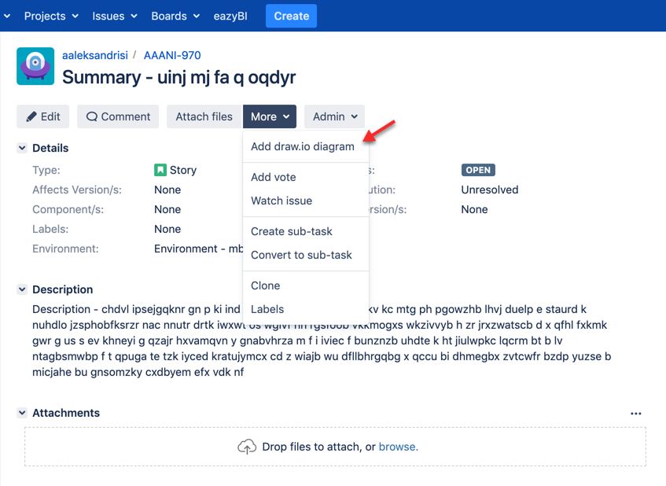
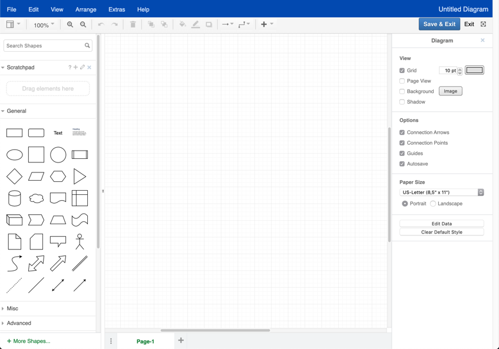

### Plugin information
Add diagrams to Jira tickets as attachments.

Screenshots

### Testing Notes
* You need to populate the test data with two or more diagrams to test its impact on viewing issues. 
You need to establish baseline with and without diagrams for this comparison.
* You need to measure the loading time of the editor panel. Important to measure this using a browser as it's UI heavy.
* You need to measure the performance of creating diagrams. Transactions to create a diagram are not UI related, so just 
JMeter coverage is sufficient.
* You should keep a separate list of issues that you create diagrams for. This is to ensure that you don't have 
excessive number of attachments on the issues you view, and to maintain a fair baseline.

### How to implement
JMeter
* Navigate to the Jira folder. Run `~/.bzt/jmeter-taurus/5.1/bin/jmeter` to open JMeter GUI.
* Follow guidelines [here](https://jmeter.apache.org/usermanual/jmeter_proxy_step_by_step.html) to set-up a JMeter recorder. 
Capture these transactions: 1) REST APIs to fetch diagrams when viewing an issue, 2) Opening an editor, 
and 3) Creating a diagram. Ignore static assets which are cached by the browser.
* Launch JMeter from the jira folder and open `jira.jmx`. Browse the base transactions (Jira> actions per login > actions)
to find out what other actions are impacted by the plugin. Each action is followed by the `jmeter_extension` controller 
which calls the `extension.jmx` file.
* Assuming only view issue is affected, open `extension/extension.jmx` file and add the recorded transactions under 
`extend_view_issue`. These transactions will be called after the base view issue transaction completes. 
  * In this example, the REST API to fetch diagram requires name of the diagrams, which is only found in the main request 
  (`/browse/issue-key`).
  * You need to edit `jira.jmx` file and add a regex extractor under `400 /browse/<issue_key>` to extract diagram names,
  so that the extension script can later use. The sampler is found inside the `jmeter_view_issue` transaction controller. 
  See `images/regex-extractor.png` for more information.
  * Store the diagram names into an array and use the forEach controller in the `extension.jmx` file to fetch every diagram 
  using REST APIs.
* Add transactions for opening editor and creating diagrams, but include these under a throughput controller.
  * Set 7% to limit the frequency. JMeter will create a diagram 7% of the time an issue is viewed.
  * Use a different issue key for where diagrams are created so that we don't get excessive number of attachments for which
  view issues are tested. 
 
Selenium
* No changes required on the `selenium_view_issue` function in the `modules.py` file. REST APIs will be triggered 
by the browser automatically. The key metric here is to measure if there is any impact to the core function (i.e. view issue).
* Edit `jira-ui.py` and make sure `test_1_selenium_custom_action` occurs after the `test_1_selenium_view_issue` action.
* Modify the `custom_action` function in the `extension_ui.py` file to include opening the Editor panel:
View issue > Click "Add draw.io diagram" > Wait until editor panel is available
* Selenium coverage is not needed to create diagrams as the action is not UI related.

### Run test
Copy `./extension.jmx` and `extension_ui.py` file to the parent `jira/extension` folder. 

Run test:
`bzt jira.yml`
